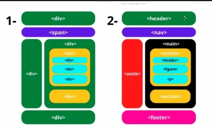
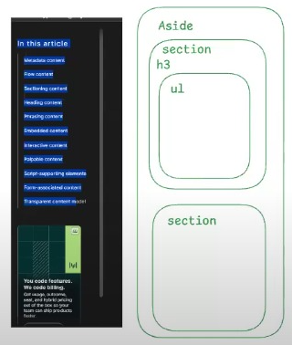
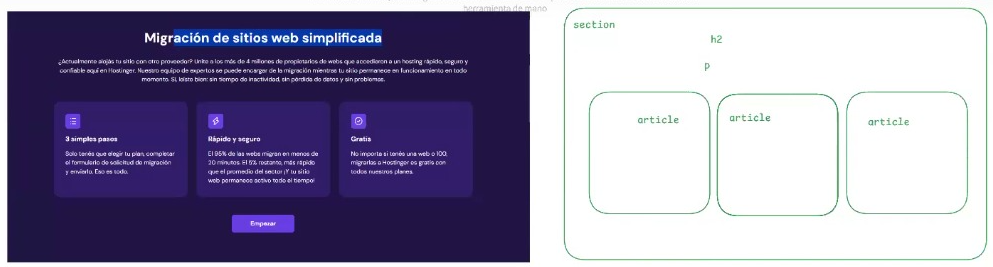

## BIBLIOGRAFIA DE HTTML ##
https://developer.mozilla.org/en-US/

###  ESTRUCTURA DEL BODY  ###

###  ESTRUCTURA ASIDE  ###

###  ESTRUCTURA DE UNA SECTION   ###

"una definición de articulo: algo que puedo sacar de donde esta y se va a seguir 
 entendiendo y teniendo sentido, (las reseñas por ejemplo si o si son articulos)"