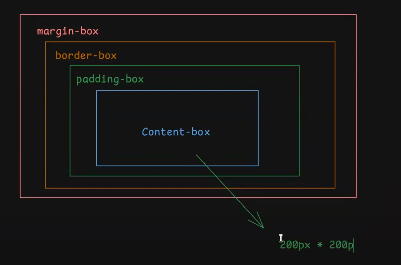

## ##############   _ /  CLASE 5  \ _   ############## ##
          ______________________________________
         /*      ##  JERARQUIA EN CSS  ##      *\
        /*                                      *\
       /*        1- !important                   *\
      /*         2- inline style                  *\
     /*          3- selector de id                 *\
    /*           4- selector de clase               *\
   /*            5- selector de elementos            *\
  /*             6- selector universal                *\
 /*                                                    *\
/* "usar solo los ultimos 3 (salvo en caso especifico)" *\

"En caso de tener el mismo valor (x,x,x) gana por cascada (el que este mas abajo)"

## ##############   _ /  CLASE 6  \ _   ############## ##

"" dar ancho y alto al contenido solo es valido para etiquetas block o inline-block ""
"" las etiquetas tienen un display que puede ser (block, inline o inline-block)     ""

inline: (ej. )                                        
    - no se le puede modificar ancho ni alto 
    - se escribe uno al lado del otro   

block: (ej. 
)                            
    - se le puede definir ancho y alto       
    - se colocan uno debajo del otro 

inline-block: (ej. <button>)
    - se le puede definir ancho y alto       
    - se colocan uno al lado del otro

## PARTES DE UNA CAJA ##

## pagina para crear cajas piolas ##
https://neumorphism.io/#e0e0e0

## pagina para importar fuentes de texto ##
https://fonts.google.com/