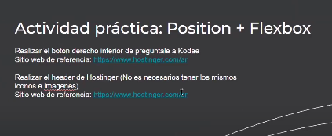

# tipos de posicionamiento:
  * relative
  * absolute
  * fixed
  * sticky

- "position: relative;"
# con position distinto de 'static' puedo usar: 
    - top: abajo, 
    - left: izquierda, 
    - right: derecha, 
    - bottom: arriba 

- z-index: 1; (controla la superposición, mayor valor está encima)

- "position: fixed;"
# el elemento te sigue por la pagina pero no guarda su lugar

- "position: sticky;"
# el sticky sigue a la pantalla pero se reserva su lugar, por eso se usa mucho en headers

# tarea
